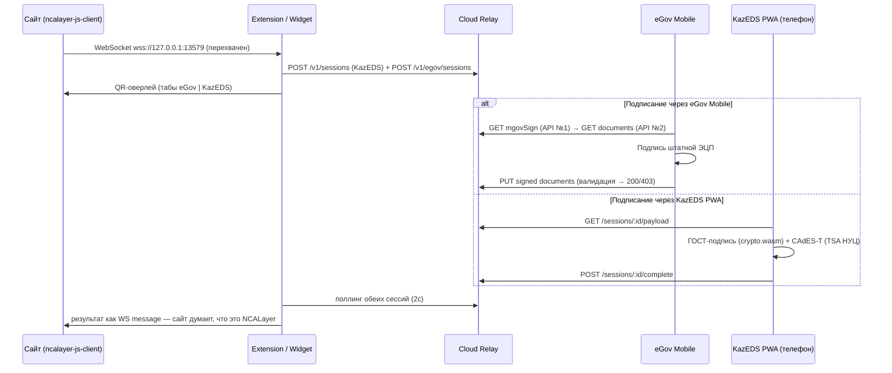

# KazEDS — Облачная замена NCALayer

Цифровая подпись без установки NCALayer. Сайты используют стандартный `ncalayer-js-client` — KazEDS перехватывает WebSocket и подписывает на телефоне: через **официальный eGov Mobile** или собственную PWA.

## Возможности

| Фича | Что даёт |
|------|----------|
| **eGov QR (egovQR)** | Подписание через официальное приложение eGov Mobile — сканируешь QR (формат `mobileSign:`) или жмёшь deeplink, подписываешь штатной ЭЦП. Домен `sign.aitu.uz` в whitelist eGov |
| **Локальное подписание в PWA** | Свой `.p12` НУЦ РК загружается в мобильную PWA (`sign.aitu.uz/app`) — ГОСТ-подпись прямо в браузере телефона (Go→WASM), ключ не покидает устройство |
| **Chrome Extension** | Эмулирует NCALayer для любого сайта: ничего не меняется на стороне сайта, QR-оверлей с табами «eGov Mobile / KazEDS» |
| **JS-виджет** | Одна строка `<script src="https://sign.aitu.uz/ext/eds.js">` — то же самое без установки расширения |
| **CAdES-T** | Метка времени RFC 3161 от боевого TSA НУЦ РК — юридически значимая подпись |
| **Верификация** | Java-верифаер (BouncyCastle + Kalkan): криптопроверка ГОСТ CMS + валидация цепочки до корня НУЦ |
| **Трейсинг** | Сквозной trace всех компонентов с полными payload (`/v1/trace`), тогглы прямо в QR-оверлее и PWA |

## Как это работает

### Перехват NCALayer (главный трюк)

Сайты (eGov, kazpatent, damubala…) общаются с NCALayer через WebSocket `wss://127.0.0.1:13579`. KazEDS не поднимает локальный сервер — он **подменяет сам класс `WebSocket`** на странице:

1. **`ws-intercept.js`** инжектится в **MAIN world** страницы при `document_start` и monkey-patch-ит `window.WebSocket`. Конструктор с URL `127.0.0.1:13579` возвращает `FakeWebSocket` — полную имитацию: `readyState`, события `open/message/close`, эмуляция heartbeat (`--heartbeat--`) и keepalive (`{}`). Любой другой URL прозрачно уходит в оригинальный `WebSocket`.
2. Сайт шлёт обычный NCALayer JSON-RPC (`{module, method, args}`) в «сокет» → `FakeWebSocket.send()` переправляет его через `window.postMessage`.
3. **`bridge.js`** (ISOLATED world) ловит сообщение и пересылает в service worker через `chrome.runtime.sendMessage`.
4. **Service worker** диспатчит по модулям — `kz.gov.pki.knca.commonUtils` (массив-аргументы), `kz.gov.pki.knca.basics` (объект), `NURSign`, KNP — и для подписи запускает flow:
   - создаёт **две** сессии в Cloud Relay: KazEDS и eGov;
   - показывает QR-оверлей (Shadow DOM) с табами «eGov Mobile | KazEDS»;
   - поллит обе сессии — выигрывает та, где юзер подписал.
5. Подпись возвращается тем же путём назад и «выстреливает» в страницу как обычное `message`-событие WebSocket. Сайт не отличает KazEDS от настоящего NCALayer.

### Два пути подписания

```
                          ┌────────────── eGov Mobile ──────────────┐
Сайт → Extension/Widget → │ QR mobileSign: → API №1/№2 → ЭЦП в eGov │ → PUT
  ncalayer-js-client      └─────────────────────────────────────────┘     ↓
        ↓ WS                                                        Cloud Relay
  FakeWebSocket           ┌────────────── KazEDS PWA ───────────────┐     ↓
        ↑                 │ QR → sign.aitu.uz/app → .p12 + WASM ГОСТ│ → POST
        └──── результат ← └─────────────────────────────────────────┘
```

В PWA, открытой по QR, тоже есть кнопка **«Подписать в eGov Mobile»** (deeplink) — если телефон один и тот же, можно прыгнуть в eGov не сканируя второй раз.

### Архитектура (диаграмма)



### Как crypto.wasm делает ГОСТ-подпись

Движок — Go, скомпилированный в WebAssembly (~7 МБ, грузится лениво при первом ГОСТ-подписании). Шаги внутри `wasmSignCMS`:

1. **PKCS#12 parse** — `.p12` расшифровывается паролем (PBE), достаются приватный ключ ГОСТ Р 34.10-2015 (256/512, национальная кривая KZ `1.2.398.3.10.1.1.2.2.1`) и цепочка сертификатов.
2. **Хеш** — данные хешируются ГОСТ Р 34.11-2015 («Стрибог», 256/512).
3. **SignedAttributes** — формируются CAdES-BES атрибуты: `contentType`, `messageDigest`, `signingTime`, `signingCertificateV2`.
4. **Подпись** — ГОСТ 34.10-2015 по DER-кодированным signedAttrs; собирается CMS/PKCS#7 (attached или detached).
5. **CAdES-T** — `wasmBuildTSARequest` строит RFC 3161-запрос (хеш значения подписи), он уходит на TSA НУЦ РК через прокси `/relay/tsa/prod` (браузер не может напрямую — CORS); `wasmApplyTSAResponse` встраивает timestampToken как unsigned-атрибут. Если TSA недоступен — остаётся CAdES-BES.
6. Для `signXml` тот же ключ создаёт **enveloped XMLDSig** (`wasmSignXML`).

Приватный ключ существует в памяти WASM только на время операции; в хранилище (IndexedDB) лежит зашифрованным AES-256-GCM с ключом из PIN (PBKDF2, 600k итераций).

## Как работает подпись

Вся криптография выполняется **на мобильном устройстве в браузере** — ключи никогда не покидают телефон. Extension и Relay не знают ничего о ключах: они передают только запрос на подпись и готовый результат.

### Два режима подписи

| | **GOST** (боевой) | **ECDSA** (демо) |
|---|---|---|
| Ключ | `.p12` файл НУЦ РК + пароль | Генерируется на лету |
| Алгоритм | ГОСТ Р 34.10-2012/2015 (256/512 бит) | ECDSA P-256, SHA-256 |
| Движок | Go → WebAssembly (`crypto.wasm`, ~7 МБ, грузится лениво) | Web Crypto API браузера |
| Совместимость | NCALayer / eGov / damubala и др. | Только тестовые сценарии |

### Форматы подписи (GOST)

- **Raw** — чистая подпись ГОСТ 34.10 (для `signPlainData` и т.п.)
- **CMS / PKCS#7** (CAdES-BES) — attached и detached, для `createCMSSignature*`
- **CAdES-T** — CMS + метка времени от TSA НУЦ РК (`tsp.pki.gov.kz`), юридически значимая подпись. Если TSA недоступен — fallback на CAdES-BES
- **XMLDSig** — enveloped-подпись XML для `signXml` / `signXmls`

### Хранение ключей

`.p12` хранится в IndexedDB телефона, зашифрованный **AES-256-GCM**. Ключ шифрования выводится из PIN-кода через **PBKDF2 (600 000 итераций, SHA-256)**. Без PIN расшифровать ключ нельзя; на сервер он не отправляется никогда.

Код: `projects/web-app/src/lib/crypto/` — `signer.ts` (выбор режима), `wasm-bridge.ts` (GOST-движок), `key-manager.ts` (шифрование и хранение).

## Сервисы

| Сервис | URL | Порт upstream | Описание |
|--------|-----|---------------|----------|
| **Landing** | `sign.aitu.uz/` | 80 (nginx, статика) | Лендинг с инструкциями и WiFi QR |
| **Web App** | `sign.aitu.uz/app/` | 5173 (Next.js, basePath=/app) | PWA — сканер QR, ключи, подписание |
| **Cloud Relay** | `sign.aitu.uz/relay/` | 3001 (Node.js Fastify) | REST API — сессии, поллинг, результаты |
| **Java Verifier** | `sign.aitu.uz/relay/verify/` | 8082 (Java + BouncyCastle) | Верификация GOST/CMS/XMLDSig подписей |
| **Widget CDN** | `sign.aitu.uz/ext/` | 80 (nginx, статика) | JS-виджет + ZIP расширения |
| **Demo Site** | `demo.aitu.uz` | 3000 | Отдельный тестовый сайт с кнопкой "Войти по ЭЦП" |
| **Nginx** | — | 80 | Reverse proxy: один vhost на всё, плюс отдельный для `demo.aitu.uz` |

## Быстрый старт

### 1. Зависимости

- Docker
- Node.js 20+ (только для pnpm install)

### 2. Прописать домены в `/etc/hosts`

```bash
echo '127.0.0.1 sign.aitu.uz demo.aitu.uz' | sudo tee -a /etc/hosts
```

### 3. Установить зависимости и собрать

```bash
docker run --rm -v $(pwd):/app -w /app node:22-alpine sh -c "corepack enable && pnpm install && pnpm build:shared"
```

### 4. Запустить все сервисы

```bash
# Relay (API)
docker run -d --name kazeds-relay --rm \
  -v $(pwd):/app -w /app -p 3001:3001 \
  node:22-alpine sh -c "corepack enable && pnpm dev:relay"

# Web App (PWA)
docker run -d --name kazeds-web-app --rm \
  -v $(pwd):/app -w /app -p 5173:5173 \
  node:22-alpine sh -c "corepack enable && pnpm dev:web-app"

# Demo Site
docker run -d --name kazeds-demo-site --rm \
  -v $(pwd):/app -w /app -p 3000:3000 \
  node:22-alpine sh -c "corepack enable && pnpm dev:demo-site"

# Nginx (reverse proxy + landing + widget CDN)
docker run -d --name kazeds-nginx --rm \
  -v $(pwd)/nginx.conf:/etc/nginx/nginx.conf:ro \
  -v $(pwd)/projects/landing:/var/www/landing:ro \
  -v $(pwd)/projects/extension:/var/www/extension:ro \
  -p 80:80 nginx:alpine
```

### 5. Проверить

```bash
# Все сервисы
curl -s http://sign.aitu.uz/                       # Landing
curl -s http://sign.aitu.uz/app/                   # Web App (PWA)
curl -s http://sign.aitu.uz/relay/health           # Relay health check
curl -s http://sign.aitu.uz/ext/eds.js | head -3   # Widget CDN
curl -s http://demo.aitu.uz/                       # Demo Site (отдельный хост)
```

### 6. Открыть в браузере

Перейдите на **http://demo.aitu.uz** и нажмите **"Войти по ЭЦП"**.

Появится QR-оверлей с обратным отсчётом.

Эмуляция подписи с телефона — в другом терминале:

```bash
# Подписать слово "demo" и отправить на Relay (автоматически найдёт сессию)
./scripts/complete.sh "" "demo"
```

QR закроется, на странице появится **"Успешно: Подпись получена (MEQCI...)"**.

### 7. Верификация подписи

```bash
# Подписать данные (выводит JSON с подписью)
./scripts/sign.sh "demo"

# Верифицировать подпись
./scripts/verify.sh "demo" "MEQCI..."

# Или одной командой: подписать → верифицировать
SIG=$(./scripts/sign.sh "demo" | python3 -c "import sys,json; print(json.load(sys.stdin)['signature'])")
./scripts/verify.sh "demo" "$SIG"
```

Пример вывода:
```
========================================
  KazEDS — Верификация подписи
========================================

Сертификат:
  Субъект:      C=KZ,O=KazEDS Demo,CN=Bagdat Mussin
  Действует:    Mar 31 13:25:20 2026 GMT — Mar 31 13:25:20 2027 GMT
  Fingerprint:  81:7A:E7:16:...

Данные:         demo
Результат:      ПОДПИСЬ ВЕРНА

  Документ "demo" подписан
  на имя C=KZ,O=KazEDS Demo,CN=Bagdat Mussin
  алгоритмом ECDSA P-256 + SHA-256
```

### Скрипты

| Скрипт | Описание |
|--------|----------|
| `scripts/sign.sh <данные>` | Подписать текст, вывести JSON (подпись + сертификат) |
| `scripts/verify.sh <данные> <подпись>` | Верифицировать подпись по данным и сертификату |
| `scripts/complete.sh [session_id] [данные]` | Подписать и отправить на Relay (эмуляция телефона) |

## Интеграция виджета на любой сайт

Одна строка в `<head>`:

```html
<script src="https://sign.aitu.uz/ext/eds.js"></script>
```

Виджет автоматически:
- Перехватывает WebSocket `wss://127.0.0.1:13579`
- Эмулирует NCALayer API
- Показывает QR-оверлей при подписании
- Поллит Relay и возвращает результат

Существующий код с `ncalayer-js-client` работает без изменений.

## API Endpoints (Relay)

| Метод | Путь | Описание |
|-------|------|----------|
| `POST` | `/v1/sessions` | Создать сессию (TTL 2 минуты) |
| `GET` | `/v1/sessions/:id/payload` | Полные данные сессии (вызывает PWA после скана) |
| `GET` | `/v1/sessions/:id/status` | Получить статус (polling) |
| `POST` | `/v1/sessions/:id/complete` | Завершить с подписью |
| `DELETE` | `/v1/sessions/:id` | Отменить сессию |
| `POST` | `/v1/trace` | Приём trace-событий (см. Трейсинг) |
| `GET` | `/v1/trace` | Чтение trace-буфера (`?session_id=&source=&limit=`) |
| `DELETE` | `/v1/trace` | Очистить trace-буфер |
| `GET` | `/health` | Health check |

## Трейсинг (распределённая отладка)

Все компоненты могут слать trace-события (с полными payload) в Relay.
По умолчанию выключено; включается на стороне клиента:

| Компонент | Как включить |
|-----------|--------------|
| Web App (PWA) | `localStorage.kazeds_trace = "1"` или `trace=true` в URL |
| Extension (service worker) | `chrome.storage.local.set({ kazeds_trace: true })` |
| Relay (lifecycle сессий) | всегда пишет в буфер (in-memory) |

Чтение собранного трейса по сессии:

```bash
curl "https://sign.aitu.uz/relay/v1/trace?session_id=<UUID>" | jq
# или всё подряд
curl "https://sign.aitu.uz/relay/v1/trace?limit=100" | jq
# очистить
curl -X DELETE https://sign.aitu.uz/relay/v1/trace
```

Буфер кольцевой (2000 событий), только в памяти — не журнал аудита.

### Создание сессии

```bash
curl -X POST https://sign.aitu.uz/relay/v1/sessions \
  -H "Content-Type: application/json" \
  -d '{"origin":"https://demo.aitu.uz","operation":"auth"}'
```

Ответ:
```json
{
  "session_id": "uuid",
  "challenge": "base64",
  "qr_payload": {
    "version": 1,
    "session_id": "uuid",
    "challenge": "base64",
    "origin": "https://demo.aitu.uz",
    "operation": "auth",
    "callback_url": "https://sign.aitu.uz/relay/v1/sessions/uuid/complete",
    "expires_at": "2026-03-31T12:00:00.000Z"
  },
  "expires_at": "2026-03-31T12:00:00.000Z"
}
```

## Тесты

```bash
docker run --rm -v $(pwd):/app -w /app node:22-alpine sh -c "corepack enable && pnpm test"
```

**159 тестов** across 11 файлов:

| Компонент | Файл | Тестов |
|-----------|------|--------|
| Shared | `constants.test.ts` | 9 |
| Relay | `session-store.test.ts` | 16 |
| Relay | `session-schema.test.ts` | 15 |
| Relay | `routes.test.ts` | 19 |
| Relay | `e2e-signing-flow.test.ts` | 10 |
| Web App | `qr-parser.test.ts` | 11 |
| Web App | `relay-client.test.ts` | 5 |
| Web App | `key-manager.test.ts` | 23 |
| Extension | `x509.test.mjs` | 6 |

## Структура проекта

```
KazEDS/
├── projects/
│   ├── shared/          # Типы, константы (TypeScript)
│   ├── relay/           # Cloud Relay API (Fastify)
│   ├── web-app/         # PWA мобильное приложение (Next.js)
│   ├── demo-site/       # Тестовый сайт (Next.js)
│   ├── extension/       # Chrome Extension (MV3) + eds.js (CDN виджет)
│   └── landing/         # Лендинг (статический HTML)
├── scripts/
│   ├── sign.sh          # Подписание данных (ECDSA P-256)
│   ├── verify.sh        # Верификация подписи
│   └── complete.sh      # Подписать + отправить на Relay
├── nginx.conf           # Reverse proxy конфигурация
├── CLAUDE.md            # Инструкции для Claude Code
├── NCALAYER.md          # Документация NCALayer протокола
└── vitest.config.ts     # Конфигурация тестов
```

## Chrome Extension

Для сайтов без виджета — Extension эмулирует NCALayer WebSocket нативно.

```bash
# Собрать ZIP
docker run --rm -v $(pwd):/app -w /app node:22-alpine \
  sh -c "apk add zip && cd projects/extension && zip -r kazeds-extension.zip . -x '*.DS_Store' -x 'src/__tests__/*'"
```

Установка: `chrome://extensions` → Режим разработчика → Загрузить распакованное расширение → выбрать `projects/extension/`.

## Роадмап / TODO

- [ ] **Share подписи** — поделиться результатом подписания ссылкой (чат/мессенджер), получатель открывает и верифицирует
- [ ] **Safari extension (iOS/macOS)** — порт расширения под Safari App Extension
- [ ] **Firefox extension** — порт под WebExtensions/Gecko
- [ ] **Подписание `.p12`-файлом внутри Chrome-расширения** — альтернатива, когда ключ лежит на компе: без телефона и PWA
- [ ] OCSP/CRL revocation-check в верифаере (negative-фикстуры уже в репо)
- [ ] XMLDSig-верификация в Java-верифаере

## Остановка сервисов

```bash
docker stop kazeds-relay kazeds-web-app kazeds-demo-site kazeds-nginx
```
